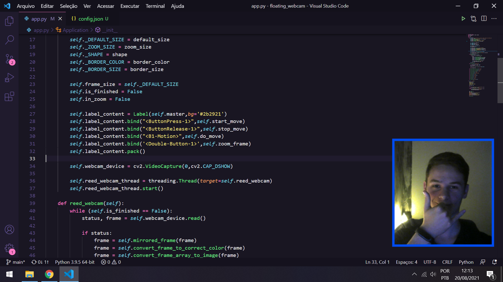

<h1 align="center">:camera: Floating Webcam</h1>
<p align="center">A simple webcam Player in Python:snake:.</p>



<br />


## Running locally

Clone de repository, open its folder and install dependencies with:

```sh
pip install requirements.txt
```

Run it using:

```sh
python app.py
```

## Usage & settings

After running for the first time you can access the app settings through the tray menu and click on "Settings" to change default shortcuts, camera size, zoom, etc.

### Default shortcuts

<table>
  <thead>
    <tr>
      <th>Keystroke</th>
      <th>Function</th>
    </tr>
  </thead>
  <tbody>    
    <tr>
      <td>Ctrl+Shift+X</td>
      <td>Close Application</td>
    </tr>
  </tbody>
</table>

## Show your support

Give a ⭐️ if this project helped you!
